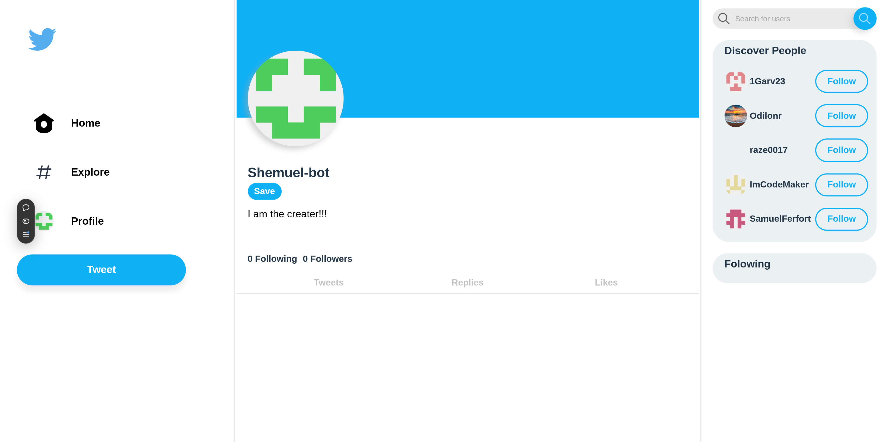

# Odin book frontend

<!-- logo -->
<div align="center">
  
  <p></p>
</div>


https://odin-book-frontend-rho.vercel.app/
## About
<div align="center">
  
</div>

### description
This is a very scaled down version of twitter. This specific repository is the frontend.

### built with
These are tools that I used to build the site

<ul>
  <li>
    <a href="https://react.dev/">React</a>
  </li>
  <li>
    <a href="https://nodejs.org/en">Node.js</a>
  </li>
  <li>
    <a href="https://expressjs.com/">Express</a>
  </li>
  <li>
    <a href="https://www.postgresql.org/">Postgresql</a>
  </li>
  <li>
    <a href="https://www.prisma.io/">Prisma</a>
  </li>
  <li>
    <a href="https://www.passportjs.org/">Passport</a>
  </li>
</ul>

### backend repository
https://github.com/Shemuel-bot/odin-book.git

## Local setup

```sh
npm run dev
```
